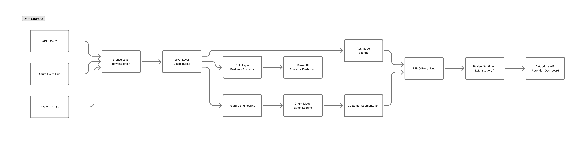

# BharatMart 360°

A Databricks pipeline that scores 92,107 customers every night and produces a call list by Monday morning. Each row shows who is likely to leave, what drove that prediction, what they complained about, and what to offer them.

**Databricks 14-Day AI Challenge · March 2026**

[](https://azure.microsoft.com/en-us/products/databricks)
[](https://delta.io)
[](https://mlflow.org)
[-8B5CF6?style=flat)](https://docs.databricks.com/en/large-language-models/ai-functions.html)

---

## Background

India's e-commerce market hit $147.3 billion in 2024. Three out of four buyers never return after their first purchase. Annual churn on the major platforms runs above 30%. Acquiring a new customer costs 5 to 25 times more than keeping one.

| Stat | Number | Source |
|------|--------|--------|
| Annual churn rate | 70–75% | Rivo / Upcounting, 2024–25 |
| One-time buyers | 75% | Naik et al., ResearchGate 2025 |
| Cost to acquire vs retain | 5–25× | HBR / Bain & Company |
| Revenue from repeat customers | 44% | Gorgias / Sobot, 2024–25 |

Most platforms track revenue and orders. They don't track which specific customers are quietly disengaging before they leave. They also treat a customer who has spent ₹69,000 across 16 orders the same as someone who bought once for ₹200. And when they do try to win customers back, they send the same coupon to everyone.

Springer's *Electronic Commerce Research* (December 2024) confirmed there is no published system combining churn prediction, customer segmentation, and personalised recommendations in a single working pipeline for Indian e-commerce. BharatMart 360° is an attempt to build one.

---

## Output

The pipeline narrows 92,107 customers down to 62 who need a call before Monday.

```
92,107  all customers scored nightly
 1,139  Critical churn risk (probability above 0.75)
   111  Urgent Champions (high-value, Critical or High risk)
    62  on the call list (Urgent Champions with a negative review)
```

Those 62 customers have ₹2,06,085 in combined lifetime spend at risk. Recovering even a quarter of them this month would bring back around ₹51,522.

---

## How the pipeline works

Three Azure services feed raw data in. It moves through three layers: Bronze (raw), Silver (cleaned and joined), Gold (aggregated for reporting). Five models run on Silver. Results reach a live dashboard by 08:00 IST every morning.



```
Azure SQL (master data)  ·  Event Hub (live orders)  ·  ADLS Gen2 (files)
                                      ↓
                    BRONZE (raw, as-is)
                                      ↓
                    SILVER (cleaned, deduplicated, joined)
                         ↓                     ↓
                    5 ML models            Gold tables
                         ↓                     ↓
               AIBI Dashboard           Power BI Dashboard
```

**Stack:** Azure Databricks Premium · Azure SQL · ADLS Gen2 · Azure Event Hub · Delta Lake · Unity Catalog · MLflow · Mosaic AI

---

## The data

72 months of synthetic Indian e-commerce data, January 2020 to December 2025, generated with CTGAN/SDV trained on real Kaggle datasets. The generation includes things that actually happened in Indian e-commerce during this period: Diwali shifting between October and November each year, the COVID lockdown dip in early 2020, UPI growing from 20% of transactions in 2020 to 72% by 2025, and the gradual expansion into Tier-2 and Tier-3 cities.

| Table | Rows |
|-------|------|
| Customers | 92,107 |
| Products | 50,000 |
| Orders | 1,621,695 |
| Sessions | 1,500,000+ |
| Reviews | 411,470 total, 369,230 usable |

---

## Data quality: 7 problems fixed in Silver

Dirty data is injected deliberately in the source layer to make cleaning testable. Every fix is logged with before/after row counts.

| Problem | Scale | Fix |
|---------|-------|-----|
| Missing customer IDs | 23,552 rows | Flagged `_null_cust`, excluded from ML |
| Duplicate rows | ~1% of records | Keep latest by `_ingested_at` |
| Mixed date formats | 175,372 rows | 6-format fallback parse chain |
| Zero-amount orders | 9 rows | Flagged, kept for audit trail |
| Two columns for the same field | All orders | `COALESCE(order_amount, subtotal)` |
| Currency mismatch in seller data | International rows | Multiply by exchange rate from seller table |
| Orders with no matching customer | 42,222 rows | Flagged `_is_ghost_order`, kept for sentiment scoring |

---

## Five models

The five models run as a chain. M1 runs first. If a customer doesn't appear in M1's output, they don't reach the call list regardless of what M2 through M5 say.

### M1: Churn prediction (XGBoost)
> Matuszelanski & Kopczewska (2022), *JTAER*. DOI: [10.3390/jtaer17010009](https://doi.org/10.3390/jtaer17010009)

Trained on 92,107 customers using 12 behavioral features: cart abandonment rate, session depth, payment method, average order value, refund rate, and others. No demographic features.

Early training hit AUC 0.9922, which was a red flag. The churn label is defined using recency and order count, and both were in the feature set. The model was just reconstructing the label. Removing those two features brought AUC to 0.6500, against the paper's benchmark of 0.6505.

SHAP analysis: `total_spent` has a SHAP value of 0.42. `avg_rating` has a SHAP value of 0.03. Customers who are about to leave stop spending first. They rarely leave a complaint before they go. This held on both the original Brazilian Olist dataset and the BharatMart data.

### M2: Customer segmentation (K-Means RFM)
> Wong, Tong & Haw (2024), *JTDE* Vol.12. DOI: [10.18080/jtde.v12n3.978](https://doi.org/10.18080/jtde.v12n3.978)

Three segments, validated by Elbow, Silhouette (0.4108 at K=3), and Calinski-Harabasz (71,482.9 at K=3).

| Segment | Count | Avg lifetime spend | Avg recency |
|---------|-------|--------------------|-------------|
| Champions | 13,948 | ₹69,207 | 2 days ago |
| Loyal Customers | 46,439 | ₹2,209 | 52 days ago |
| At Risk | 31,720 | ₹565 | 66 days ago |

Champions spend 122 times more on average than At Risk customers. Combined with M1 churn probability, M2 produces a `retention_priority` column (Urgent, High, Medium, Low) that drives everything downstream.

### M3: Product recommendations (ALS collaborative filtering)
> Padhy et al. (2024), *MDPI Engineering Proceedings* Vol.67. DOI: [10.3390/engproc2024067050](https://doi.org/10.3390/engproc2024067050)

Recommends products based on purchase history, cart events, and reviews. Behavioral signals rather than explicit ratings: cart add = 0.5 confidence, purchase = 1.0, 4–5 star review = 2.0.

Worth noting: `recommendForAllUsers()` fails on Databricks Serverless because the output (284MB) exceeds the 268MB Spark Connect limit. The fix is numpy matrix multiplication in 1,000-user chunks. Covers 97.1% of customers; the rest get popular-product fallbacks.

### M4: Re-ranking (RFMQ entropy weights)
> Chen et al. (2025), *Frontiers in Big Data* Vol.8. DOI: [10.3389/fdata.2025.1680669](https://doi.org/10.3389/fdata.2025.1680669)

Takes M3's top-10 recommendations and re-orders them based on what each customer segment needs. A Champion at Urgent risk sees high-margin products at the top. An At Risk customer sees familiar, lower-commitment products.

The entropy weights come from the data. For BharatMart, Monetary got a weight of 0.774. The reference paper gave it 0.145. That difference comes from spread: Champions average ₹69,207 and At Risk customers average ₹565, a 122× gap. In the UK retail dataset from the paper, the spend spread was narrower so Monetary mattered less.

NDCG@10 improved 25.5% over raw ALS output.

### M5: Sentiment analysis (Mosaic AI)
> Roumeliotis et al. (2024), *Elsevier NLP Journal* Vol.6. DOI: [10.1016/j.nlp.2024.100056](https://doi.org/10.1016/j.nlp.2024.100056)

Runs `ai_query()` against 369,230 reviews. The prompt asks for three things: sentiment label (positive/neutral/negative), a confidence score, and an array of specific issues the customer mentioned. Zero parse failures across the full dataset.

One finding worth flagging: negative reviews are distributed almost evenly across all churn risk bands. About 18% of reviews are negative whether the customer is Critical, High, Medium, or Low risk. Unhappy customers and churning customers are not the same group. Knowing someone left a complaint doesn't tell you whether they're about to leave. You need M1 for that.

40,970 customers gave 4 or 5 stars but wrote something negative. Rating-only analysis misses all of them.

---

## Benchmark results

| Model | Reference paper | Their result | BharatMart |
|-------|----------------|-------------|------------|
| M1 XGBoost | Matuszelanski (2022) | AUC 0.6505 | AUC 0.6500 |
| M2 K-Means | Wong et al. (2024) | Silhouette 0.47 | Silhouette 0.4108 (dataset is 25× larger) |
| M3 ALS | Padhy et al. (2024) | RMSE 1.4485 | 9.5× random baseline |
| M4 RFMQ | Chen et al. (2025) | F1 +81% at TOP-5 | NDCG@10 +25.5% |
| M5 Sentiment | Roumeliotis (2024) | Near-zero parse failures | 0 failures / 369,230 reviews |

---

## Dashboard

Five pages on Databricks AIBI, updated every night.

| Page | What it shows |
|------|--------------|
| Retention Overview | 94,502 customers · 28.3% flagged at some level of risk · 111 Urgent |
| Churn Risk | 515 Critical · 26,216 High · average churn probability 57.5% |
| Customer Value | Champions average ₹2,04,620 lifetime · full segment breakdown |
| Review Insights | 369,230 reviews scored · 40,969 hidden dissatisfied · top complaint categories |
| Action Center | 62 customers · average churn probability 55.2% · ₹2,06,085 at risk |

The Action Center on page 5 is the main output. Each row has a customer ID, their churn probability, the feature SHAP flagged as the primary driver, the issues they wrote about in their review, and three recommended products from RFMQ. The retention team can use that row directly for an outreach call.

There's also a Genie Space connected to all the Gold tables for natural-language queries: "Which customers in Delhi complained about delivery and haven't ordered in 30 days?" Works well for filtering and aggregations.

---

## Repo structure

```
├── ML Models/
│   ├── ALS Reccomendation/
│   │   ├── ALS Collaborative Filtering - EDA.ipynb
│   │   ├── ALS Collaborative Filtering - Model Training.ipynb
│   │   └── Batch Scoring.ipynb
│   ├── Customer Churn Prediction/
│   │   ├── Customer Churn Prediction - EDA.ipynb
│   │   ├── Customer Churn Prediction - Feature Engineering.ipynb
│   │   ├── Customer Churn Prediction - Model Training.ipynb
│   │   ├── batch_scoring.ipynb
│   │   └── feature_engineering_prod.ipynb
│   ├── Mosaic Ai/
│   │   └── Review Sentiment Analysis.ipynb
│   ├── RFM Segmentation/
│   │   ├── Batch Scoring.ipynb
│   │   ├── FM Customer Segmentation - EDA.ipynb
│   │   ├── RFM Customer Segmentation - Clustering.ipynb
│   │   └── RFM Customer Segmentation - Model Training & Reg.ipynb
│   └── RFMQ/
│       ├── RFMQ Batch Scoring.ipynb
│       ├── RFMQ Model: Weight Matrix Build & Registration.ipynb
│       └── RFMQ Model: Weight Matrix Build & Registration (1).ipynb
├── Pipeline/
│   ├── bronze_exploration.py
│   ├── bronze_ingestion.py
│   ├── gold_layer.py
│   ├── silver_eda.py
│   ├── silver_transform.py
│   └── sql_to_bronze.py
├── BharatMart 360 Intelligence Dashboard.pdf
└── README.md
```

---

## References

| Paper | DOI |
|-------|-----|
| Matuszelanski & Kopczewska (2022). Customer Churn in Retail E-Commerce. *JTAER* | [10.3390/jtaer17010009](https://doi.org/10.3390/jtaer17010009) |
| Wong, Tong & Haw (2024). Customer Segmentation using RFM. *JTDE* Vol.12 | [10.18080/jtde.v12n3.978](https://doi.org/10.18080/jtde.v12n3.978) |
| Padhy et al. (2024). Recommendation System using ALS. *MDPI Eng. Proc.* Vol.67 | [10.3390/engproc2024067050](https://doi.org/10.3390/engproc2024067050) |
| Chen et al. (2025). Intelligent Recommendation + Customer Value. *Frontiers Big Data* Vol.8 | [10.3389/fdata.2025.1680669](https://doi.org/10.3389/fdata.2025.1680669) |
| Roumeliotis et al. (2024). LLMs for Sentiment Analysis. *Elsevier NLP Journal* Vol.6 | [10.1016/j.nlp.2024.100056](https://doi.org/10.1016/j.nlp.2024.100056) |
| Jahan & Sanam (2024). A comprehensive framework for customer retention in e-commerce. *Electronic Commerce Research*, Springer | [10.1007/s10660-024-09936-0](https://doi.org/10.1007/s10660-024-09936-0) |
| Bain & Company / Flipkart (2025). How India Shops Online 2025 | [bain.com](https://www.bain.com/insights/how-india-shops-online-2025/) |
